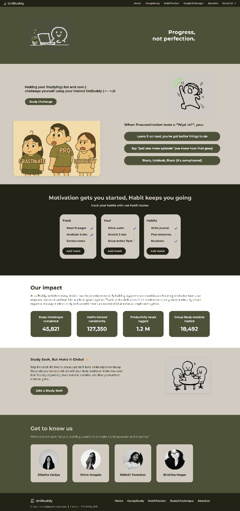
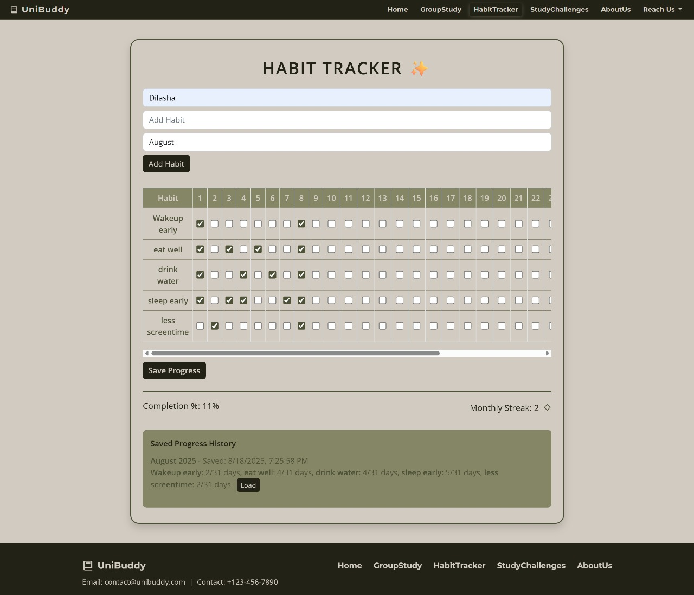
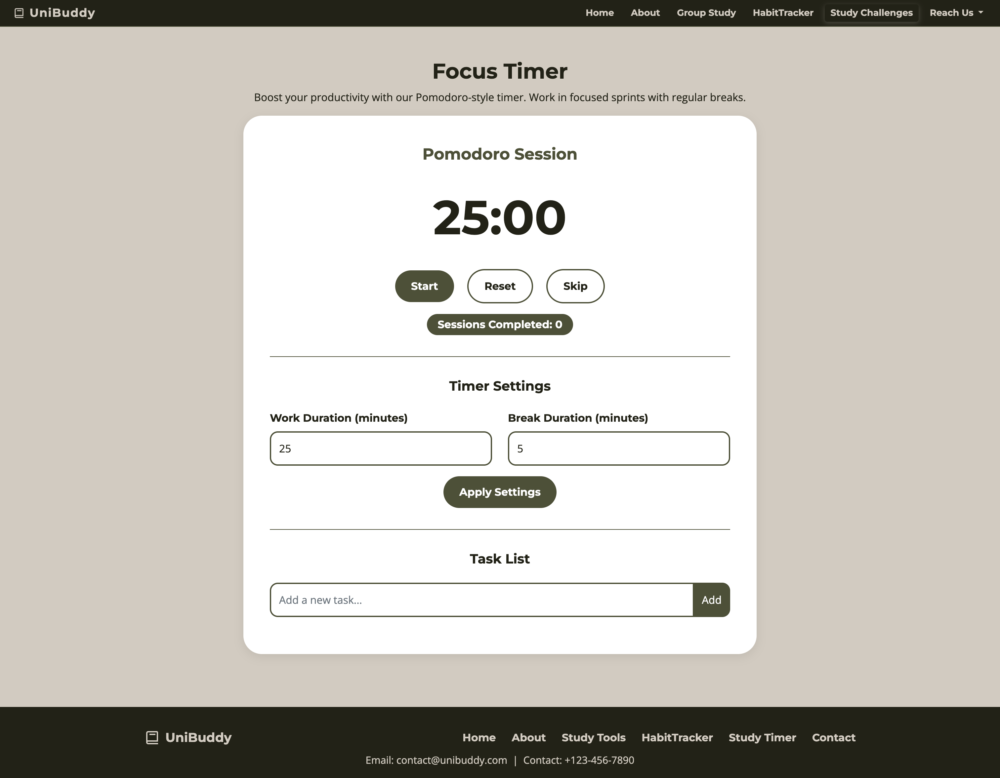
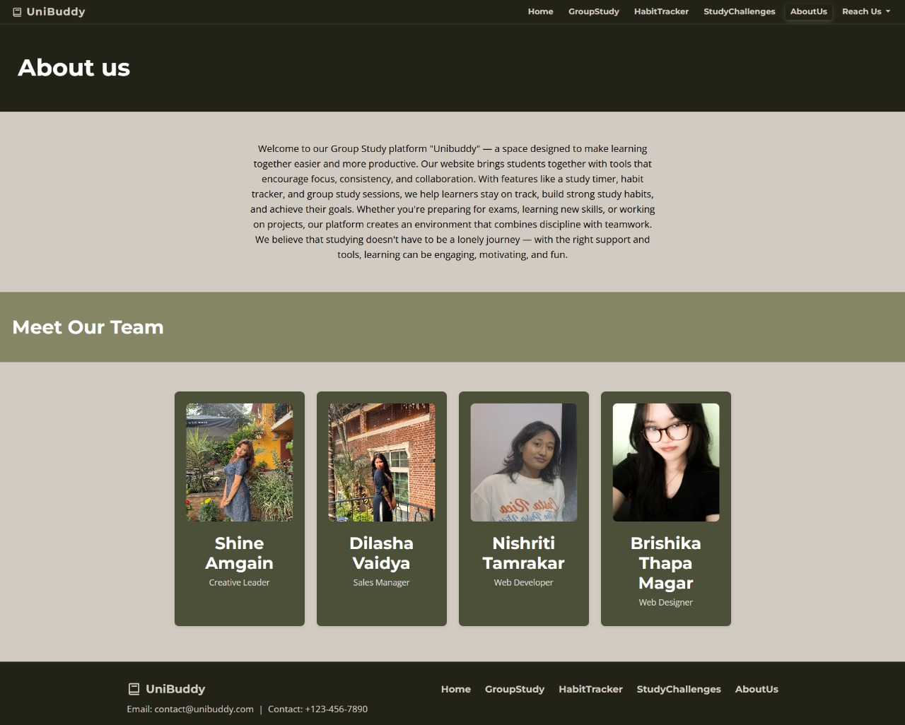

<!DOCTYPE html>
<html lang="en">
<head>
  <meta charset="UTF-8" />
  <meta name="viewport" content="width=device-width, initial-scale=1.0"/>
  <title>UniBuddy – README</title>
  
</head>
<body>
  <h1>📚 UniBuddy</h1>
  
<em>Progress, not perfection.</em>

  

    UniBuddy is a web platform built by students, for students — making studying 
    <strong>fun, social, and productive</strong>. With habit tracking, group study, 
    study challenges, and procrastination quizzes, UniBuddy helps you stay consistent and motivated.
  

  <h2>⚡ Features</h2>
  <ul>
    <li>🎯 Study Challenges – currently includes a ⏳ Pomodoro Timer to stay focused with structured study & break intervals.</li>
    <li>🧘 Habit Tracker – build and track habits that stick.</li>
    <li>👥 Group Study – hop into study sessions with friends.</li>
    <li>📓 Study Notes – take, organize, and review your study materials.</li>
    
  </ul>

  <h2>🚀 Setup Instructions</h2>
  <pre><code># Clone the repo
git clone https://github.com/your-username/unibuddy.git
cd unibuddy

# Run locally (example using Python)
python -m http.server 8000
  </code></pre>
  
Then open <a href="http://localhost:8000">http://localhost:8000</a> in your browser.

# Hosted through GitHub Pages 
<a href= "https://shineamgain.github.io/Summerclassweb/"> https://shineamgain.github.io/Summerclassweb/</a>

  <h2>👩‍💻 Contributors</h2>
  
 
    <a href="https://github.com/shineamgain" target="_blank">@shineamgain</a>
    <a href="https://github.com/dilashavaidya" target="_blank">@dilashavaidya</a>
    <a href="https://github.com/nishriti" target="_blank">@nishrititamrakar</a>
    <a href="https://github.com/brishikamagar" target="_blank">@brishikamagar</a>

  

  <h2>📸 Screenshots</h2>
  
<strong>Home page Preview</strong>

   

  
<strong>Habit tracker Preview</strong>

  
  
<strong>Group Study</strong>

  

  
<strong>Study Challenges Preview</strong>

  

<strong>About us Preview</strong>

  

  <h2>🎥 Demo</h2>
  

    <iframe src="https://www.youtube.com/embed/your-demo-link" 
            title="Demo video" frameborder="0" allowfullscreen></iframe>
  

  <h2>📝 License</h2>
  
This project is open-source under the <a href="LICENSE">MIT License</a>.

</body>
</html>
